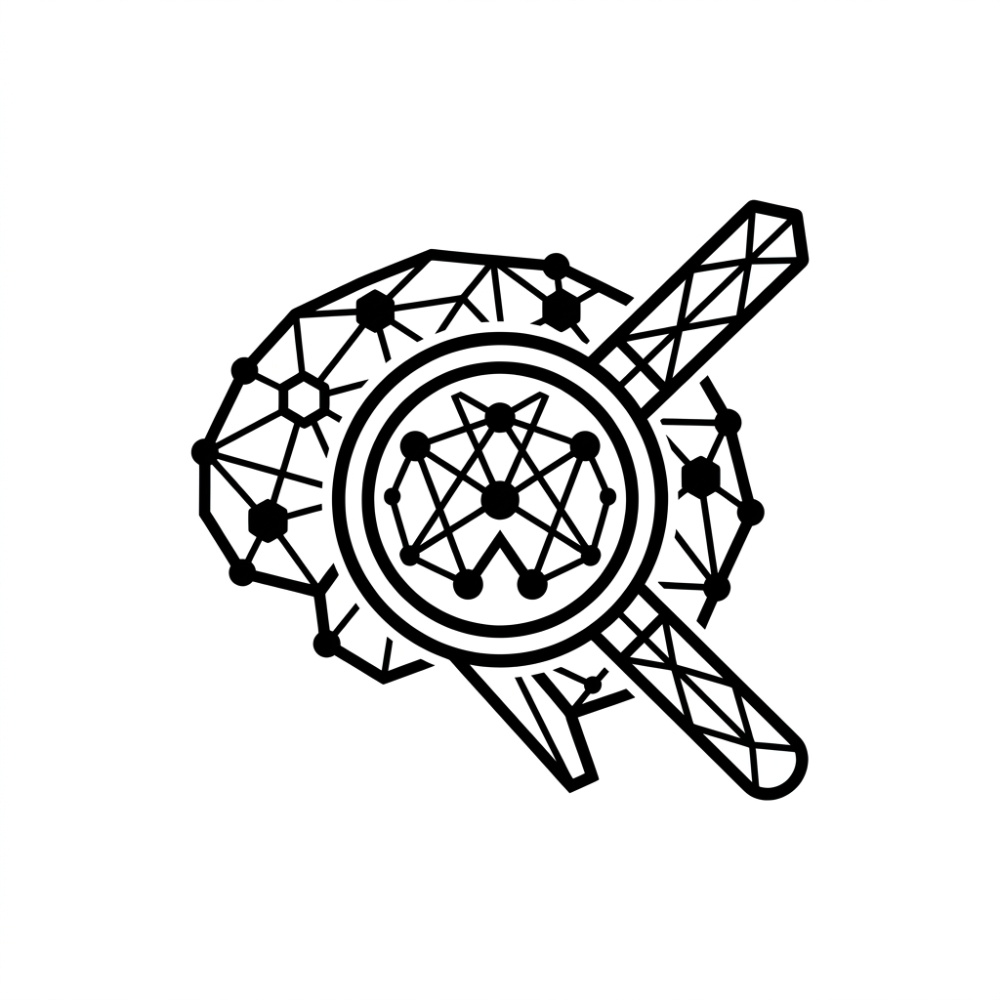

<p align="center">
  
</p>

<h1 align="center">kharajch — WebXResearch</h1>

<p align="center">
  <strong>AI-Powered Web Research Summarizer</strong><br/>
  Paste any URL. Get instant summaries, key insights, and follow-up answers — powered by NVIDIA NIM.
</p>

<p align="center">
  
  
  
  
  
</p>

---

## ✨ Overview

**WebXResearch** turns information overload into instant clarity. Drop in a link to any article, blog, documentation, or paper — and the app fetches the content, processes it through NVIDIA NIM (meta/llama-3.1-70b-instruct), and returns a beautifully structured summary complete with key takeaways and topic tags.

Need to go deeper? The built-in **AI Chat** lets you ask follow-up questions directly against the webpage's context, just like talking to a research assistant who already read the whole page for you.

---

## 🎥 Features

| Feature | Description |
|---|---|
| 🔗 **URL Summarization** | Paste any URL to get a structured summary, key points, and topic tags |
| 💬 **Contextual Chat** | Ask follow-up questions against the summarized content |
| 📚 **Research History** | Past sessions saved in `localStorage` — pick up where you left off |
| 🌐 **3D Background** | Immersive Three.js particle scene rendered with React Three Fiber |
| 🎨 **Glassmorphic UI** | Black & white frosted-glass aesthetic with smooth animations |
| ⚡ **Streaming UX** | Loading skeletons, smooth scrolling, and animated transitions |
| 🛡️ **Error Handling** | User-friendly error messages at every layer (network, API, AI) |

---

## 🏗️ Architecture

```
┌──────────────────────────────┐       ┌──────────────────────────────────┐
│         FRONTEND             │       │           BACKEND                │
│  Next.js 16 + React 19      │       │  Python FastAPI + LangChain      │
│                              │       │                                  │
│  ┌────────┐  ┌────────────┐  │  POST │  ┌──────────────┐               │
│  │ Hero   │  │ Scene3D    │  │ ─────►│  │ WebBaseLoader│ Fetch website  │
│  └────────┘  │ (Three.js) │  │  /research  └──────┬───────┘             │
│  ┌────────┐  └────────────┘  │       │         ▼                        │
│  │SearchBar│                 │       │  ┌──────────────────┐            │
│  └───┬────┘                  │       │  │ TextSplitter     │            │
│      ▼                       │       │  │ (Recursive Char) │            │
│  ┌────────┐                  │       │  └──────┬───────────┘            │
│  │Summary │  Key Points,     │       │         ▼                        │
│  │Display │  Topics, Title   │  ◄────│  ┌──────────────────┐            │
│  └───┬────┘                  │  JSON │  │ NVIDIA NIM       │            │
│      ▼                       │       │  │ (meta/llama-3.1) │            │
│  ┌────────┐                  │  POST │  │ Structured Output│            │
│  │ChatBox │ ────────────────►│ ─────►│  └──────────────────┘            │
│  └────────┘                  │  /chat│                                  │
│  ┌────────────┐              │  ◄────│  ┌──────────────────┐            │
│  │ChatHistory │ localStorage │       │  │ NVIDIA NIM (Chat)│            │
│  └────────────┘              │       │  └──────────────────┘            │
└──────────────────────────────┘       └──────────────────────────────────┘
```

---

## 🛠️ Tech Stack

### Frontend

- **[Next.js 16](https://nextjs.org/)** — App Router, server components, file-based routing
- **[React 19](https://react.dev/)** — Latest React with hooks and Suspense
- **[React Three Fiber](https://docs.pmnd.rs/react-three-fiber)** + **[Three.js](https://threejs.org/)** — 3D particle background
- **[Framer Motion](https://motion.dev/)** — Declarative animations
- **[GSAP](https://gsap.com/)** — High-performance timeline animations
- **Vanilla CSS Modules** — Scoped styling with CSS custom properties (no Tailwind)

### Backend

- **[FastAPI](https://fastapi.tiangolo.com/)** — High-performance async Python API
- **[LangChain](https://python.langchain.com/)** — LLM orchestration framework
- **[NVIDIA NIM](https://www.nvidia.com/en-us/ai-data-science/generative-ai/nim/)** — Production-ready AI inference microservices
- **[BeautifulSoup](https://www.crummy.com/software/BeautifulSoup/)** — Web content extraction via `WebBaseLoader`
- **Pydantic** — Request/response validation with structured output

---

## 🚀 Getting Started

### Prerequisites

- **Node.js** ≥ 18
- **Python** ≥ 3.12
- **NVIDIA API Key** (Get one at [build.nvidia.com](https://build.nvidia.com/))

### 1. Clone the Repository

```bash
git clone https://github.com/kharajch/kharajch---WebXResearch.git
cd kharajch---WebXResearch
```

### 2. Set Up Environment Variables

Create a `.env` file in the project root:

```env
NVIDIA_API_KEY=your_nvidia_api_key_here
NVIDIA_MODEL=meta/llama-3.1-70b-instruct
```

### 3. Install & Run the Frontend

```bash
npm install
npm run dev
```

The frontend will be live at **<http://localhost:3000>**.

### 4. Install & Run the Backend

```bash
cd backend
python -m venv venv

# Windows
venv\Scripts\activate

# macOS/Linux
source venv/bin/activate

pip install -r requirements.txt
uvicorn main:app --reload
```

The API will be live at **<http://localhost:8000>**.

---

## 📁 Project Structure

```
kharajch---WebXResearch/
├── app/                          # Next.js App Router
│   ├── components/               # React UI components
│   │   ├── Scene3D.js            # Three.js 3D particle background
│   │   ├── Hero.js               # Animated hero section with logo
│   │   ├── SearchBar.js          # URL input with validation
│   │   ├── Summary.js            # AI summary display + skeleton loader
│   │   ├── ChatBox.js            # Follow-up chat interface
│   │   ├── ChatHistory.js        # Saved research sessions
│   │   ├── Footer.js             # Site footer
│   │   ├── ErrorMessage.js       # Dismissible error alerts
│   │   └── *.module.css          # Scoped component styles
│   ├── globals.css               # Design system, tokens & theme
│   ├── layout.js                 # Root layout with SEO metadata
│   └── page.js                   # Main page orchestrator
├── backend/                      # Python FastAPI backend
│   ├── main.py                   # API routes & LangChain pipeline
│   ├── requirements.txt          # Python dependencies
│   └── venv/                     # Virtual environment (not committed)
├── public/                       # Static assets
│   ├── logo.png                  # App logo
│   └── favicon.png               # Browser favicon
├── .env                          # Environment variables (not committed)
└── package.json                  # Node.js dependencies & scripts
```

---

## 🔌 API Reference

### `POST /research`

Summarize a webpage.

**Request:**

```json
{
  "url": "https://example.com/article"
}
```

**Response:**

```json
{
  "title": "Article Title",
  "summary": "A comprehensive 3-5 paragraph summary...",
  "key_points": ["Point 1", "Point 2", "..."],
  "topics": ["Topic A", "Topic B", "..."]
}
```

### `POST /chat`

Ask a follow-up question.

**Request:**

```json
{
  "question": "What are the main findings?",
  "context": "The research summary context...",
  "history": [
    { "role": "user", "content": "Previous question" },
    { "role": "assistant", "content": "Previous answer" }
  ]
}
```

**Response:**

```json
{
  "answer": "Based on the research, the main findings are..."
}
```

### `GET /`

Health check — returns `{ "status": "ok" }`.

---

## 🎨 Design Philosophy

- **Black & White Glassmorphism** — Frosted-glass panels with subtle transparency over an immersive 3D background
- **Micro-Animations** — Every interaction has feedback: hover effects, smooth reveals, loading skeletons
- **3D Immersion** — A floating particle system (React Three Fiber) provides depth and movement
- **Vanilla CSS** — No utility-class bloat; pure CSS Modules with custom properties for a clean, maintainable design system

---

## 📄 License

This project is open source.

---

<p align="center">
  Built with ☕ and curiosity by <strong>@kharajch</strong>
</p>
